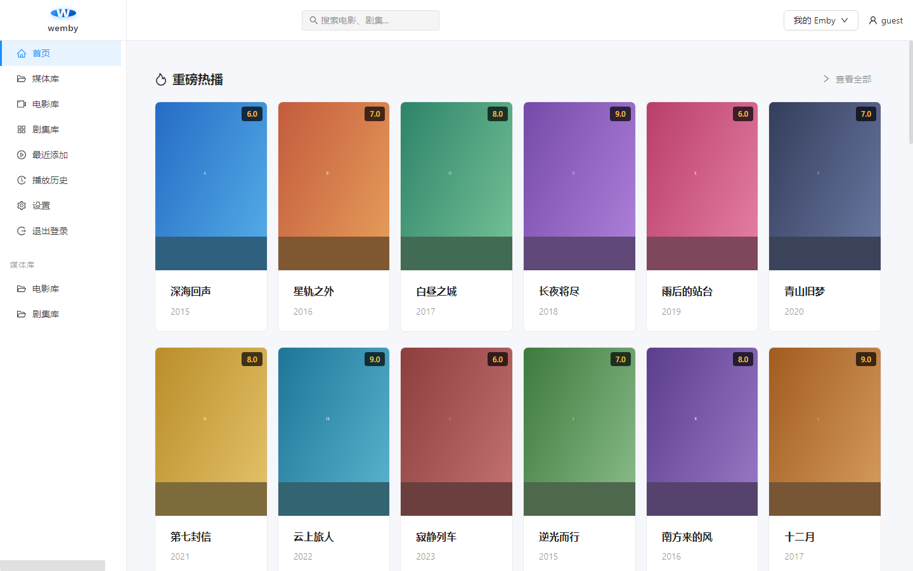
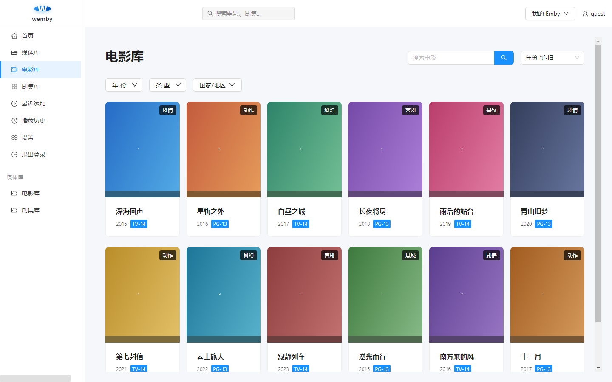
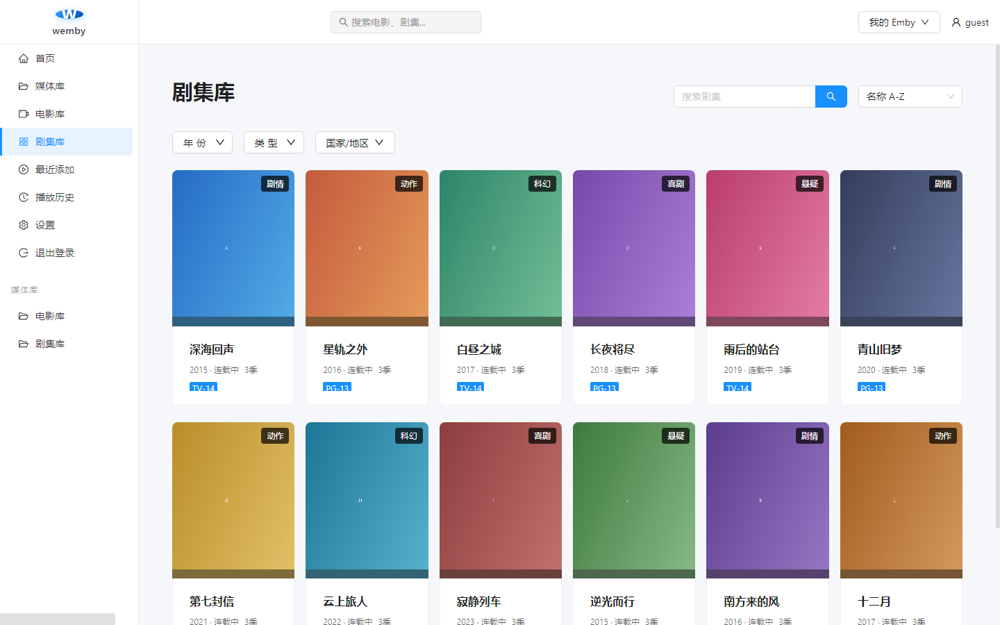
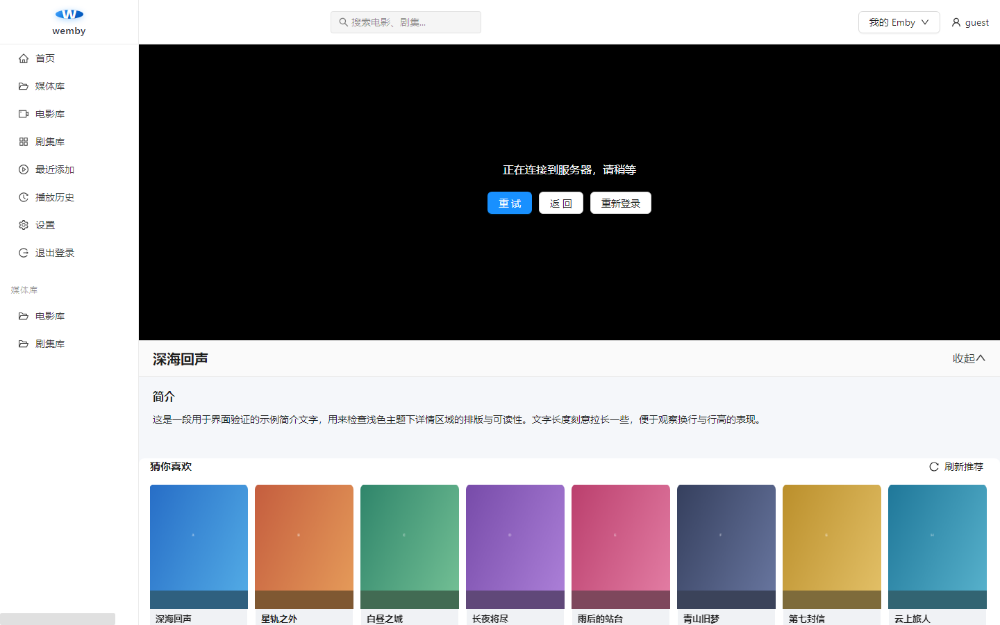
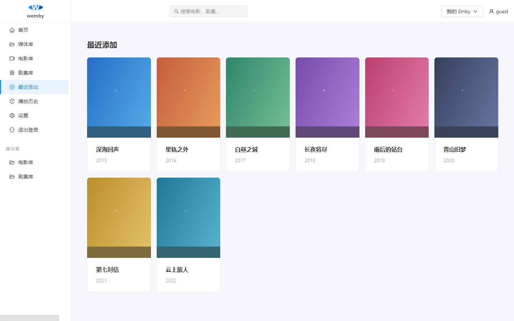
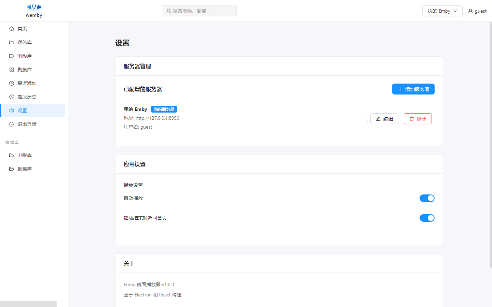

# wemby

> 一个轻量、干净的 Emby 桌面播放器 —— **默认浅色主题**，装完就能用。

<p>
  
  
  
  
  
</p>

wemby 是一个面向 [Emby](https://emby.media/) 媒体服务器的桌面客户端，把网页版的 Emby 变成
一个独立、顺手的桌面程序：不用再开浏览器、不用再忍受深色界面和网页标签页。
基于 Electron + React + TypeScript 构建，界面默认使用**浅色主题**。

---

## 📸 界面预览

### 首页 —— 重磅热播 / 分类聚合



### 电影库 —— 支持搜索、年份 / 类型 / 国家筛选与排序



### 剧集库



### 播放页 —— 视频画面上方是影片详情、剧集选择与相关推荐



### 最近添加



### 设置 —— 服务器管理与播放设置



---

## ✨ 功能特点

- **默认浅色主题**：整体浅白配色，长时间看不刺眼；只有视频画面区域保持黑色。
- **直接播放 Emby 内容**：支持 HLS 流媒体，可切换码流与字幕。
- **媒体库浏览**：电影库、剧集库、最近添加、播放历史一应俱全。
- **搜索**：顶部搜索框可直接搜影片、剧集、单集。
- **筛选与排序**：按年份、类型、国家/地区筛选，按添加时间 / 名称 / 年份 / 评分排序。
- **剧集连播**：剧集自动取第一季第一集开始播放，播放页可切换季与集。
- **多服务器**：可保存多个 Emby 服务器并随时切换，凭据本地加密存储。
- **免安装可用**：同时提供安装版与免安装版。

---

## ⬇️ 下载安装

前往 [**Releases**](https://github.com/xikkcn/wemby/releases) 页面下载，按需选择：

| 文件 | 说明 |
| --- | --- |
| `wemby-Setup-x.y.z.exe` | **安装版（推荐）**。双击安装，可自选安装位置，自动创建桌面与开始菜单快捷方式，带卸载程序。 |
| `wemby-Portable-x.y.z.exe` | **免安装版**。双击直接运行，不写注册表、不装到系统里，适合放 U 盘或临时使用。 |

> **首次运行提示**：本程序未购买代码签名证书，Windows SmartScreen 可能提示
> 「Windows 已保护你的电脑」。点 **更多信息 → 仍要运行** 即可，属于正常现象。

系统要求：Windows 10 / 11 / Windows Server 2016 及以上（64 位）。

---

## 🚀 使用说明

### 1. 添加服务器

首次打开会停在 **设置 → 服务器管理**，点击 **添加服务器**，填写：

| 字段 | 说明 |
| --- | --- |
| 服务器名称 | 随便起，只用于在界面里区分，例如「家里的 Emby」 |
| 服务器地址 | 只填主机名或 IP，**不要带 `http://`**，例如 `192.168.1.10` 或 `emby.example.com` |
| 协议 | 局域网通常是 `http`；用域名 + HTTPS 证书时选 `https` |
| 端口 | Emby 默认 `8096`，HTTPS 默认 `8920`；不填则用协议默认端口 |
| 用户名 / 密码 | 你在 Emby 里的账号，填了之后下次会自动登录 |

点 **测试连接** 确认能通，再保存。

### 2. 登录

保存服务器后，点右上角 **登录**（若已填过用户名密码会自动登录）。登录成功后
左侧栏会多出你 Emby 上的媒体库列表。

### 3. 浏览与播放

- 左侧栏切换 **首页 / 媒体库 / 电影库 / 剧集库 / 最近添加 / 播放历史 / 设置**。
- 顶部搜索框输入 2 个字以上会实时给出结果，点结果直接播放。
- 点海报开始播放；点剧集会从该剧第一季第一集开始。
- 播放页下方依次是 **影片详情**、**猜你喜欢**；剧集在详情区可切换季/集。
- 播放器右下角可切换码流（清晰度）与字幕。

### 4. 播放设置

**设置 → 应用设置** 里可开关：

- **自动播放**：进入播放页自动开始播放。
- **播放结束时返回首页**：播完自动回到首页，适合追剧。

### 5. 数据存在哪

服务器地址、账号与登录令牌保存在本机应用数据目录（Electron 的 `localStorage`）中，
其中服务器配置做了 AES 加密。**卸载或删除该目录即彻底清除**，不会上传到任何地方。

---

## ❓ 常见问题

**Q：打开是白屏 / 一直转圈？**
先确认不是杀毒软件拦截。若之前装过旧版本，删除应用数据目录后重开一次。

**Q：连不上服务器？**

- 地址栏只写主机名/IP，不要带 `http://` 前缀，前缀由「协议」下拉框决定。
- 确认端口填对：HTTP 默认 `8096`，HTTPS 默认 `8920`。
- 自签名证书的 HTTPS 服务器已做忽略证书校验处理，正常可以连上。
- 检查电脑与 Emby 服务器是否在同一网络、防火墙是否放行该端口。

**Q：能登录、能看列表，但点播放没反应 / 黑屏？**
多数是 Emby 服务端转码未开启或该视频编码浏览器内核不支持。可先在 Emby 网页端试播同一个视频，
如果网页端也要转码，请检查服务端的转码设置（硬件转码/FFmpeg 路径）。

**Q：播放历史/最近添加不显示海报？**
这两个页面依赖 Emby 返回的图片标签，请确认服务端刮削正常。

**Q：为什么视频区域是黑的？**
播放器画面本身用黑底是刻意的（和主流视频网站一致，避免亮边框影响观感），
界面其余部分都是浅色。

---

## 🛠️ 从源码构建

需要 Node.js 18+（推荐 20/22）。

```bash
git clone https://github.com/xikkcn/wemby.git
cd wemby

# 安装依赖
npm install

# 开发模式（Vite 热更新 + Electron）
npm run dev            # 另开一个终端运行下面这条
npm run electron:dev

# 只构建前端
npm run build

# 打包 Windows 安装版 + 免安装版，产物在 dist_electron/
npm run electron:build
```

### 国内网络加速

仓库自带 `.npmrc`，已把 Electron 与 electron-builder 的下载源指向国内镜像：

```ini
registry=https://registry.npmmirror.com
electron_mirror=https://npmmirror.com/mirrors/electron/
electron_builder_binaries_mirror=https://npmmirror.com/mirrors/electron-builder-binaries/
```

如果打包时仍报 `Bad Gateway` / 无法下载 Electron，说明 electron-builder 没有读到 `.npmrc`，
请显式导出环境变量后再打包：

```bash
export ELECTRON_MIRROR="https://npmmirror.com/mirrors/electron/"
export ELECTRON_BUILDER_BINARIES_MIRROR="https://npmmirror.com/mirrors/electron-builder-binaries/"
npm run electron:build
```

### 目录结构

```
main.js                 Electron 主进程入口（窗口创建、加载页面）
preload.js              预加载脚本
index.html              Vite 的 HTML 入口
vite.config.ts          Vite 配置（输出到 dist/renderer）
buildResources/
  icon.ico              Windows 图标（含 16~256 共 7 种尺寸）
public/
  icon.png              应用窗口图标
src/renderer/
  main.tsx              React 入口（使用 HashRouter）
  App.tsx               路由与 Ant Design 主题配置
  components/           布局、搜索栏、媒体库组件
  pages/                首页、电影库、剧集库、播放页、最近添加、播放历史、设置
  stores/               Zustand 状态管理（服务器 / 登录 / 媒体库）
  styles/variables.scss 全局样式变量
docs/images/            README 用的界面截图
```

---

## 🔧 相比原项目的改动

本项目基于开源项目 [CodeCrafter-bit/emby-player](https://github.com/CodeCrafter-bit/emby-player)
（MIT）改造而来，主要改动：

1. **默认浅色主题**：原项目只有写死的深色主题。现已把整体配色改为浅色并设为默认，
   包括播放页原本深色的「影片详情 / 剧集选择 / 猜你喜欢」区域；仅视频画面保持黑色。
2. **修复打包后路由失效**：原项目使用 `BrowserRouter`，而打包后页面以 `file://` 加载，
   会导致白屏；已改为 `HashRouter`。
3. **修复最近添加 / 播放历史 / 搜索头像图片裂图**：原代码保存的服务器地址只有主机名，
   缺少协议与端口，导致拼出的图片地址无效；已改为保存完整地址。
4. **修复未打包运行时找不到入口文件**：`npm start` 会因路径只找 `dist/index.html`
   而报 `ERR_FILE_NOT_FOUND`，现已统一按候选路径查找。
5. **清理无效代码**：源码中 `.tsx` 与旧的编译产物 `.js` 并存，Vite 会优先加载 `.js`
   导致改动不生效，已移除这些编译产物；同时删除了未被使用的旧入口文件。
6. **改名与图标**：应用名、窗口标题、任务栏与安装包名称改为 `wemby`，
   并重新设计了圆角渐变 + 播放三角图标（7 种尺寸）。
7. **瘦身安装包**：渲染层是 Vite 打包的自包含产物、主进程只用 Node 内置模块，
   因此打包时排除 `node_modules`，安装包体积明显减小。

---

## 📦 技术栈

Electron 25 · React 18 · TypeScript 5 · Vite 4 · Ant Design 5 · Zustand · Axios ·
HLS.js · Video.js · Sass

---

## ⚠️ 免责声明

本项目仅供学习与研究使用，请勿用于商业用途。使用本软件所产生的任何后果由使用者自行承担。
本项目不提供任何媒体内容，也不对第三方 Emby 服务器及其内容的合法性负责。

---

## 📝 许可证

[MIT](LICENSE) © 2025 xikkcn

本项目包含来自 [CodeCrafter-bit/emby-player](https://github.com/CodeCrafter-bit/emby-player)
的代码，其原始版权声明已依 MIT 许可证保留于 [LICENSE](LICENSE) 文件中。
